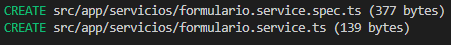
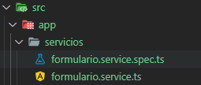
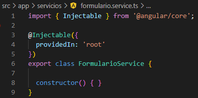
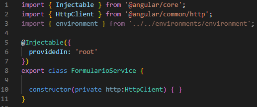
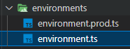
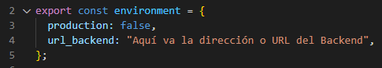

# Creando servicios en Angular

## ¿Qué es un Servicio en Angular?
Básicamente un servicio es un proveedor de datos, que mantiene lógica de acceso a ellos y operativa relacionada con el negocio y el procesamiento de datos dentro de una aplicación <br>

Los servicios serán consumidos por los componentes, que delegarán en ellos la responsabilidad de acceder a la información y la realización de operaciones con los datos

## Creando un servicio en Angular

Siguiendo la misma lógica de como crear un componente. Vamos a utilizar la consola de angula _ng_ y escribir el siguiente comando:

```
ng generate service servicios/formulario

```

donde:
```
ng: Usamos la consola de angular
generate: indicamos que vamos a generar algo
service: indicamos que, lo que vamos a generar es un servicio
servicios/formulario: indicamos que, vamos a crear el servicio llamado formulario dentro de una carpeta llamada servicios
```

Esto  generará el servicio llamado "FormularioService".<br>

<br>

<br>
Donde se configurará el servicio en el archivo formulario.service.ts que se encuentra en src/app/servicios/formulario.service.ts
<br>


## Configurando un servicio en Angular

Para configurar un servicio debemos considerar los siguientes puntos importantes:
```
1- Cliente HTTP
3- Ruta de un servidor externo o Backend 

```
Vamos abrir el servicio FormularioService recientemente creado y agregaremos los siguientes códigos.

Cliente HTTP
```
import { HttpClient } from '@angular/common/http';

```
Variable de entorno (Backend)
```
import { environment } from '../../environments/environment';

```
Luego, debemos instanciar en el constructor una variable con las propiedades del cliente HTTP para que se puedan utilizar en el servicio:
```
constructor(private http:HttpClient) { }

```
Quedando de la siguiente forma: <br>


<br>
Ahora. Vamos a crear una variable global en la cual asignaremos la ruta de un servidor externo o Backend. Para esto, nos vamos a dirigir a la siguiente ruta: _src/app/environments/environments.ts
<br>


<br>
Y vamos agregar la siguiente variable global

```
url_backend: "Aquí va la dirección o URL del Backend";

```
Como se ve acontinuación: 
<br>



<br>
Ahora vamos a volver a nuestro servicio _FormularioService_ que se encuentra en la ruta src/app/servicios/formulario.service.ts y Vamos a instanciar la variable global creada en environments.ts llamada url_backend que tendra en el futuro la dirección de nuestro Backend.<br>
Variable a instanciar:

```
url_backend = environment.url_backend;
```

Esta variable se instanciará en la siguiente ubicación de nuestro servicio:

```
export class FormularioService {
  url_backend = environment.url_backend;
  constructor(private http:HttpClient) { }
```
Y listo. Nuestro servicio esta configurado y listo para ser programado.


### 🤓 ACTIVIDAD: Enviando datos al servicio <b>contacto</b> 🤓
Vamos a enviar datos capturados de nuestro formulario a un servicio que crearémos.
Por lo que deberán crear:
```
1- Proyecto nuevo en Angular
2- Crear un formulario Reactivo que reciba: nombre, apellido, edad y email
```

Recordar el laboratorio de componentes y formulario reactivo:
 [Clic Aquí para el laboratorio de componentes y formulario](https://edgardocayo.cl/wp-content/uploads/2022/11/U3-Lab-1Formulario-Reactivo-Angular-Tecnologias-Web.docx.pdf)

 <br>
 
 Ahora. Vamos a enviar los datos del formulario al servicio que crearemos... DEMOSTRACIÓN